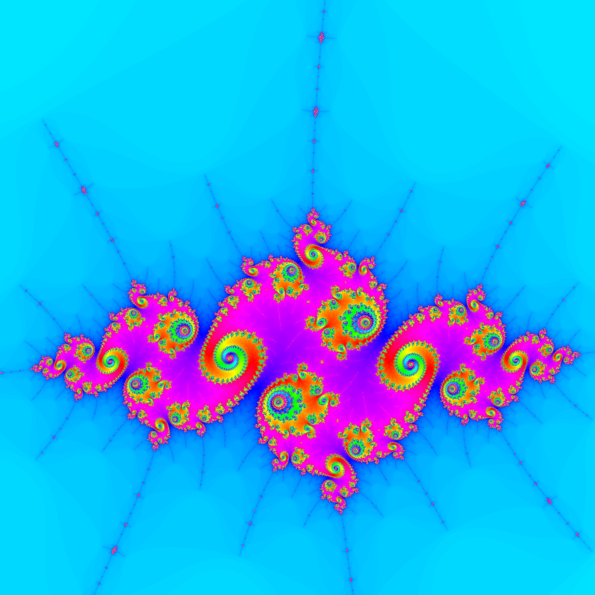

# Mandelbrot Renderer

This Rust program renders mandelbrot images


*Rendered with binary mode*


*Rendered with colored mode*


*Rendered with colored mode and with color frequency 4*


*Rendered with:* `mandelbrot_generator colored -R -1.768778833 -I 0.001738996 -z 2500000 -i 1500 -o 75`


*Rendered with:* `mandelbrot_generator colored -R -0.373974 -I 0.65977 -z 500000 -i 1500`

## Build

Build with cargo:

```bash
cargo build --release
```

## Arguments

```text
Arguments:
  <MODE>  Render mode [possible values: binary, colored]

Options:
  -t, --threads <THREADS>
          Number of threads (0 -> auto) [default: 0]
  -p, --path <PATH>
          Path of output image [default: out.png]
  -i, --iterations-max <ITERATIONS_MAX>
          Number of max iterations per pixel [default: 100]
  -r, --res <RES>
          Image resolution [default: 2048]
  -f, --color-frequency <COLOR_FREQUENCY>
          Color frequency if used in colored render mode [default: 1]
  -o, --color-offset <COLOR_OFFSET>
          Color offset if used in colored render mode [default: 0]
  -R, --center-re <CENTER_RE>
          Center real coordinate [default: -0.75]
  -I, --center-im <CENTER_IM>
          Center imaginary coordinate [default: 0]
  -z, --zoom <ZOOM>
          Render zoom scale [default: 0.67]
  -h, --help
          Print help
  -V, --version
          Print version
```

## Changelog

### 1.2.0

- Added zoomed renders
- Center coordinates can be set with the -R or --center_re (for real number) and -I or --center_im (for imaginary number) argument
- The zoom scale can be set with -z or --zoom argument
- New short arguments for path (-p), color frequency (-f) and color offset (-o)

### 1.1.0

- Added multithreading
- Number of threads can be set with the -t or --threads argument (default: 0 -> auto)
- Changed CLI output

### 1.0.1

- Fixed wrong render information

### 1.0.0

- First version

## Future plans

- [x] Multithreded rendering
- [x] Zoomed renders
- [ ] GPU rendering
- [ ] Optimized rendering
- [ ] More color modes
