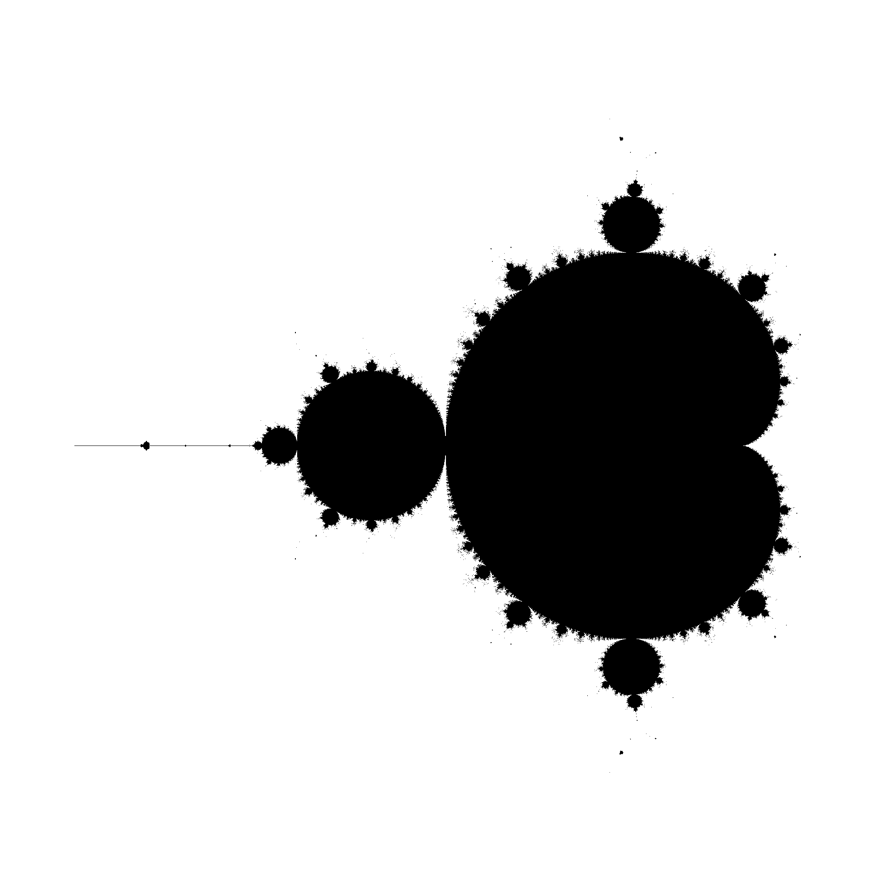
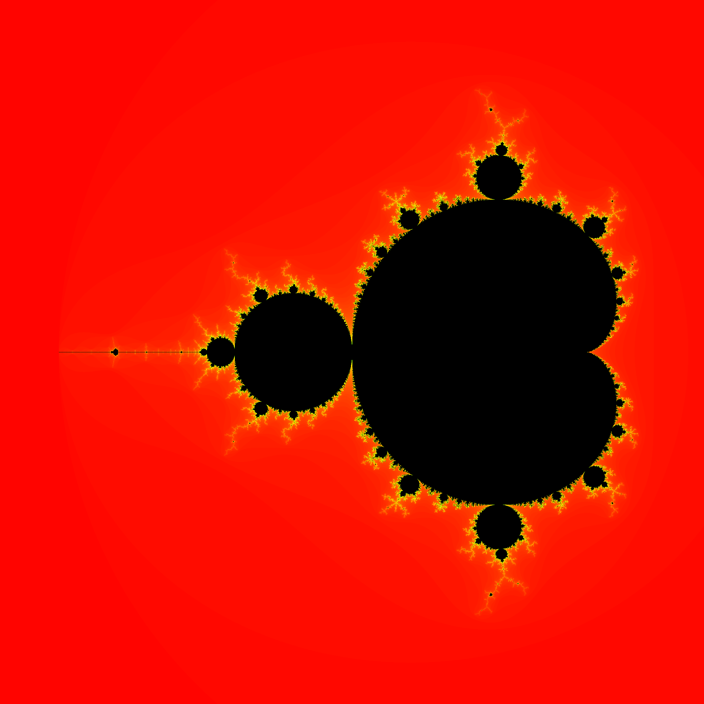
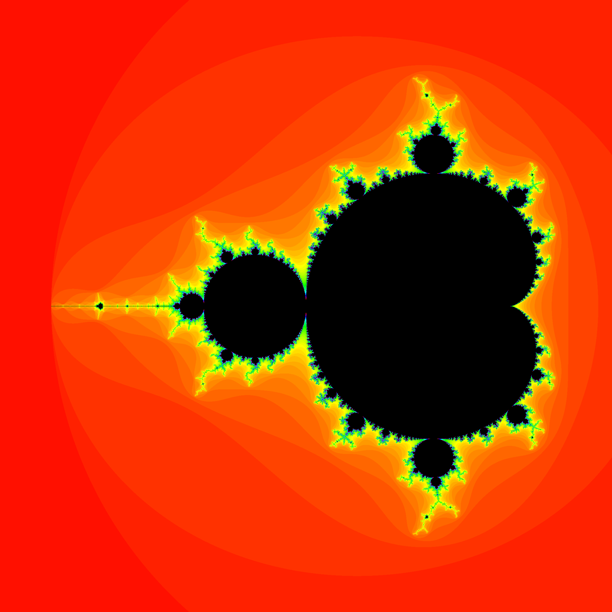

# Mandelbrot Renderer

This Rust program renders mandelbrot images


*Rendered with binary mode*


*Rendered with colored mode*


*Rendered with colored mode and with color frequency 4*

## Build

Build with cargo:

```bash
cargo build --release
```

## Arguments

```text
Arguments:
  <MODE>  Render mode [possible values: binary, colored]

Options:
      --path <PATH>
          Path of output image [default: out.png]
  -i, --iterations-max <ITERATIONS_MAX>
          Number of max iterations per pixel [default: 100]
  -r, --res <RES>
          Image resolution [default: 2048]
      --color-frequency <COLOR_FREQUENCY>
          Color frequency if used in colored render mode [default: 1]
      --color-offset <COLOR_OFFSET>
          Color offset if used in colored render mode [default: 0]
  -h, --help
          Print help
  -V, --version
          Print version
```

## Changelog

### 1.0.0

- First version

## Future plans

- Multithreaded rendering / GPU rendering
- Optimized rendering
- Zoomed renders
- More color modes
